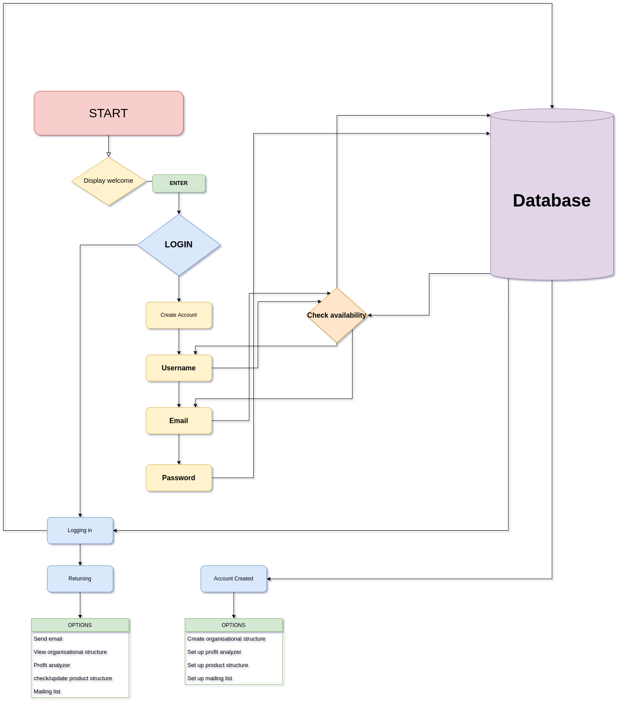
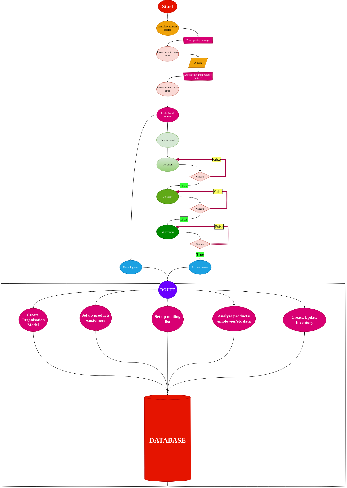

# Rapid Silver

Developer: Kristian Colville

[Visit Rapid Silver](https://rapid-silver.herokuapp.com/)

(Image of final terminal)

## Table of Contents
* [Project Goals](#project-goals)
    * [User Goals](#user-goals)
    * [Site Owners Goals](#site-owners-goals)
* [User Experience](#user-experience-ux)
    * [Target Audience](#target-audience)
    * [User Requirements and Expectations](#user-requirements-and-expectations)
* [User Stories](#user-stories)
    * [CLI App User](#cli-app-user)
    * [CLI App Owner](#cli-app-owner)
* [Design](#design)
    * [Color Scheme](#color-scheme)
    * [Fonts](#color-scheme)
    * [Structure](#color-scheme)
    * [Wireframes](#wireframes)
* [Technologies & Tools](#technologies--tools)
    * [Main Tech](#main-tech)
    * [Python Packages Used](#python-packages-used)
* [Logic](#logic)
    * [Initial Flow](#initial-flow)
    * [Python Logic](#python-logic)
* [Features](#features)
* [Data Model](#data-model)
    * [Class Overview](#class-overview)
    * [Database Overview](#database-overview)
* [Testing](#testing)
    * [Testing User Stories](#testing-user-stories)
* [Validation](#validation)
    * [HTML Validation](#html-validation)
    * [CSS Validation](#css-validation)
    * [JavaScript Validation](#javascript-validation)
    * [Python validation](#python-validation)
        * [PEP8 validation](#pep8-validation)
        * [Linters](#Linters)
    * [LightHouse](#lighthouse)
* [Bugs](#bugs)
* [Deployment](#deployment)
    * [Version Control](#version-control)
    * [Heroku](#heroku)
    * [Cloning this Repository](#cloning-this-repository)
* [Credits](#credits)
* [Acknowledgements](#acknowledgements)

## Project Goals

The goals of this project include:

- Designing a back-end application for users with small to medium sized businesses
- It should provide users with the ability to store and access user accounts
- This is a CLI project so the application should work in a terminal
- Use the [python programming language](https://www.python.org/) to build the application

### User Goals

- To be able store and access accounts for users of various types
- Log in or create an account
- Update, check and monitor products in order to forecast future events

### Site Owners Goals

- Build a CLI business utility tool for people who are self-employed/freelancers or have small to medium sized businesses
- Provide the ability for users to log in and create user accounts
- Design it so a user can set up a mailing list to send emails using the [simple mail transfer protocol](https://en.wikipedia.org/wiki/Simple_Mail_Transfer_Protocol)
- Build it using a [back-end language](https://en.wikipedia.org/wiki/Frontend_and_backend)

[Back to Top](#table-of-contents)

## User Experience
### Target Audience

- Any user who needs to use a business utility tool
- Users who are self-employed or freelancing and need to send large volumes of emails
- Small to medium sized businesses that need to use payroll software
- Self starters who would like to set up a business model and structure for a new venture

### User Requirements and Expectations

- Clear navigation through the [CLI](https://en.wikipedia.org/wiki/Command-line_interface)
- Information provided to help guide users
- Any errors or actions are handled and work as expected
- There should be appropriate feedback displayed for the interactions provided
- Help should be provided where appropriate
- The user is guided through the program in a logical and meaningful way
- The user would expect to see log in options for the program
- Any user would expect the application to have a high degree of security

[Back to Top](#table-of-contents)

## User Stories
### CLI App User

1. I want to understand how to use this CLI application
2. I want the ability to log in and out of the application
3. I want to set up an organization model
4. I want the application to look professional for my organization
5. I want to set up mailing lists
6. I want to be able to store email addresses securely
7. I want to use a secure application
8. I want to update/set up product analyzing
9. I want to keep track of my inventory
10. I want to know my data is secure and that I can trust this application
### CLI App Owner

11. I want my application to be visually pleasing
12. I want my users to access the app securely
13. I want users to have options
14. I want visually pleasing product/customer/user etc analysis
15. I want adaptable data structuring to meet different user needs
16. I want users to feel safe while using my application

[Back to Top](#table-of-contents)
## Design
### Color Scheme
### Fonts
### Structure
### Wireframes

[Back to Top](#table-of-contents)
## Technologies & Tools
### Main Tech
### Python Packages Used

[Back to Top](#table-of-contents)
## Logic
### Initial Flow

### Python Logic

[Back to Top](#table-of-contents)
## Features

[Back to Top](#table-of-contents)
## Data Model

### Class Overview
Object Orientated programming was used throughout the project. The CLI application consists of 5 classes and 3 subclasses.

- User
    - RapidUser
    - Employee
- PasswordManager
- ColorPrint
    - TextPrint
- Company
- Product

### Database Overview

[Back to Top](#table-of-contents)
## Testing
### Testing User Stories

[Back to Top](#table-of-contents)
## Validation
### HTML Validation
### CSS Validation
### JavaScript Validation
### Python validation
#### PEP8 validation
#### Linters
### LightHouse

[Back to Top](#table-of-contents)
## Bugs

| Bug | Fix |
| --- | --- |
| Environment variable for MongoDB password not being accessed, keep getting a NameError | Found the issue online and realized that the config variable was wrong, I removed the quotes and got access to the password for MongoDB |
| 1 | 2 |
| 1 | 2 |
| 1 | 2 |
| 1 | 2 |

[Back to Top](#table-of-contents)
## Deployment
### Version Control
I used [Visual Studio Code](https://code.visualstudio.com/) as a local repository and IDE & [GitHub](https://github.com/) as a remote repository.

1. Firstly, I needed to create a new repository on Github [rapid-silver](https://github.com/KristianColville1/rapid-silver).
2. I opened that repository on my local machine by copying the URL from that repository and cloning it from my IDE for use.
3. Visual Studio Code opened a new workspace for me.
4. I created files and folders to use.
5. To push my newly created files to GitHub I used the terminal by pressing Ctrl + shift + `.
6. A new terminal opened and then I used the below steps.

    - git add (name of the file) *This selects the file for the commit*
    - git commit -m "Commit message: (i.e. Initial commit)" *Allows the developer to assign a specific concise statement to the commit*
    - git push *The final command sends the code to GitHub*

### Heroku
As a deployment solution I chose [Heroku](https://dashboard.heroku.com).

To deploy a project using Heroku follow these steps:

- Log into heroku
- Go to the heroku dashboard
- Create a new app by selecting 'New'
- Give your application a name and select a preferred location
- Click the 'Create app' button
- If you have config variables in your application
    - Click on settings
    - Click 'Reveal config vars'
    - Input your deployment variables

- If you need specific build packs
    - Click on settings
    - Click on build pack
    - Add your packs as needed (Please be aware that the order matters)
    - For Rapid Silver, Python and then NodeJs was selected.

- Once these steps are completed
    - Go to the deploy section
    - Select your version control system
    - For Rapid Silver, GitHub was selected

- Connect your version control system
- Add your repository
- Connect the app selecting 'connect'
- Either choose automatic deployment or manual deployment
- Once all these steps are completed and the build is successful
    - You can click the 'view' button
    - It will reveal your deployed app
    
### Cloning this Repository
If you would like to clone this repository please follow the bellow steps.

Instructions:

1. Log into GitHub
2. Navigate to the repository you want to clone
3. Click on the green button labelled 'Code'
4. Copy the URL under the HTTPS option
5. Open an IDE of your choosing that has Git installed
6. Open a new terminal window in your IDE
7. Type this exactly: git clone the-URL-you-copied-from-GitHub
8. Hit Enter

You should have a local copy of the repository to use on your machine.

[Back to Top](#table-of-contents)
## Credits

Function for clearing the console if an error occurs taken from [Delf Stack](https://www.delftstack.com/howto/python/python-clear-console/).

[Back to Top](#table-of-contents)
## Acknowledgements
[Back to Top](#table-of-contents)