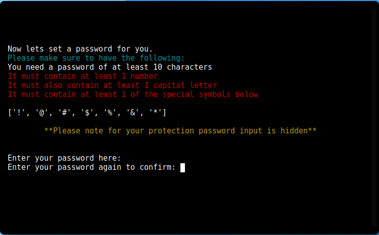
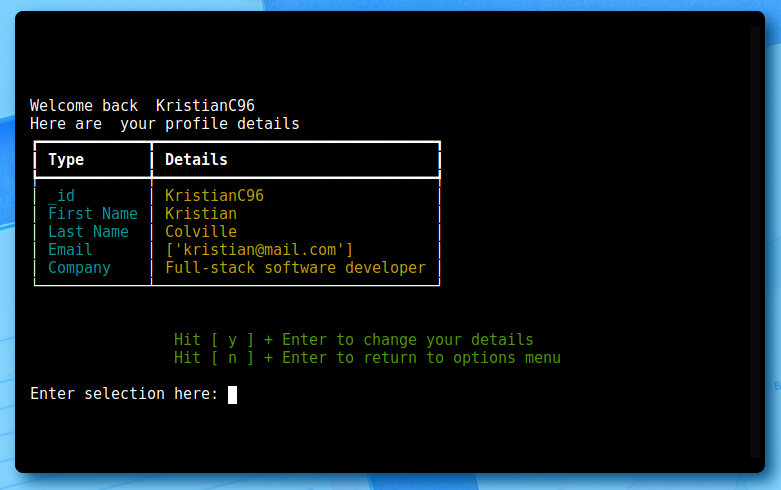
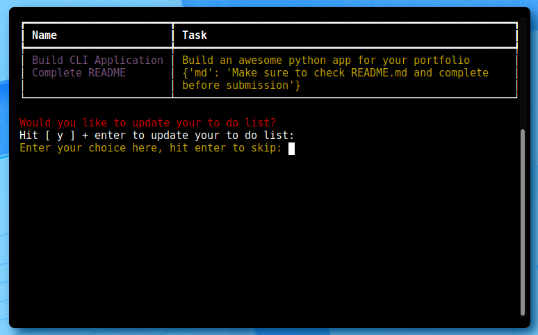

# Rapid Silver

Developer: Kristian Colville

[Visit Rapid Silver](https://rapid-silver.herokuapp.com/)

(Image of final terminal)

## Table of Contents
* [Project Goals](#project-goals)
    * [User Goals](#user-goals)
    * [Site Owners Goals](#site-owners-goals)
* [User Experience](#user-experience-ux)
    * [Target Audience](#target-audience)
    * [User Requirements and Expectations](#user-requirements-and-expectations)
* [User Stories](#user-stories)
    * [New User](#new-user)
    * [Returning User](#returning-user)
    * [Owner](#owner)
* [Design](#design)
    * [Color Scheme](#color-scheme)
    * [Fonts](#color-scheme)
    * [Structure](#color-scheme)
* [Logic](#logic)
    * [Initial Flow](#initial-flow)
    * [Python Logic](#python-logic)
* [Technologies & Tools](#technologies--tools)
    * [Main Tech](#main-tech)
    * [Python Packages Used](#python-packages-used)
* [Features](#features)
* [Data Model](#data-model)
    * [Class Overview](#class-overview)
    * [Database Overview](#database-overview)
* [Testing](#testing)
    * [Testing User Stories](#testing-user-stories)
* [Validation](#validation)
    * [Python validation](#python-validation)
        * [PEP8 validation](#pep8-validation)
        * [Linters](#Linters)
    * [LightHouse](#lighthouse)
* [Bugs](#bugs)
* [Development & Deployment](#deployment--deployment)
    * [Version Control](#version-control)
    * [Cloning this Repository](#cloning-this-repository)
    * [Heroku](#heroku)
* [Credits](#credits)
* [Acknowledgements](#acknowledgements)

## Project Goals

The goals of this project include:

- Designing a back-end application for users with in need of a software utility tool for business
- It should provide users with the ability to store and access data
- This is a CLI project so the application should work in a terminal
- Use the [python programming language](https://www.python.org/) to build the application

### User Goals

- To be able store and access an account within Rapid Silver
- Log in or create an account
- Add some form of data and manipulate it for specific needs

### Site Owners Goals

- Build a software utility tool for small business users
- Provide the ability for users to log in and create user accounts
- Design it so a user can set up a data in ways that are unique to them
- Build it using a [back-end language](https://en.wikipedia.org/wiki/Frontend_and_backend)

[Back to Top](#table-of-contents)

## User Experience
### Target Audience

- Any user who needs to use a software utility tool to analyze some form data
- Users who are self-employed or freelancing or run small businesses
- Users who may need to manage and update inventories of some form like employees/customers/products
- People starting new ventures in need to managing their new companies

### User Requirements and Expectations

- Clear navigation through the [CLI](https://en.wikipedia.org/wiki/Command-line_interface)
- Information provided to help guide users
- Any errors or actions are handled and work as expected
- There should be appropriate feedback displayed for the interactions provided
- Help should be provided where appropriate
- The user is guided through the program in a logical and meaningful way
- The user would expect to see log in options for the program
- Any user would expect the application to have a high degree of security

[Back to Top](#table-of-contents)

## User Stories
### New User

1. As a new user I want to understand how to use this CLI application
2. As a new user I want to create an account to store my personal information
3. As a new user I want to be able store and analyze some form of data

### Returning User

4. As a returning user I want to be able to log into the application
5. As a returning user I want to be able to update inventory/customers/products etc.
6. As a returning user I want to see available options

### Owner

7. As the owner I want my users data to be stored safely
8. As the owner I want my users passwords uniquely encrypted in the database for extra protection
9. As the owner I want users to see sample data and understand how to use the program

[Back to Top](#table-of-contents)
## Design
### Color Scheme

Although not a requirement for the CLI application some colors were chosen for the website containing the terminal. I chose to use Coolers to make a palette for the website. 

### Fonts

As I mentioned above, the site itself was not a requirement for this project but fonts were chosen for the site containing the terminal.

I chose 'Anton', sans-serif as my website font. I got it from Google Fonts.

### Structure

The structure of the terminal application was designed to be easily navigated and in order of importance. The terminal consists of 80 columns and 24 rows. Each menu of navigation appears when needed.

- The application contains the following menus:
    - Welcome Menu with a prompt for the user to press enter so that the next menu can be printed to the terminal
    - Leading on from the welcome menu is another menu reminding the user of available options to them and prompting for the user to click enter again
    - After the user clicks enter on the reminder of options, the log in portal menu is shown and the user can either create a new account or log in as a returning user. This provides the user with flexibility to store and access their data.
    - Entering from the account creation route the next screens involve username and password validation and checking for conflicts in the database
    - From the login side for returning users the user is welcomed back.
    - Coming back to the main route in the main route menu which can be navigated seamlessly to and from the various options within

- From the main menu for the different selections the user has options for:
    - Setting up products
    - Setting up mailing lists
    - Setting up employee lists
    - Storing inventory/ updating inventory
    - Analyzing inventory data
    - Information on data protection
    - How data is stored and protected

[Back to Top](#table-of-contents)

## Logic
### Initial Flow

### Python Logic

[Back to Top](#table-of-contents)

## Technologies & Tools
### Languages Used

- [HTML](https://en.wikipedia.org/wiki/HTML)
- [CSS](https://en.wikipedia.org/wiki/CSS)
- [JavaScript](https://en.wikipedia.org/wiki/JavaScript)
- [Python](https://en.wikipedia.org/wiki/Python)

### Frameworks, Libraries & Tools

- [Coolors](https://coolors.co/) to get palette colors for the website
- [Balsamiq](https://balsamiq.com/) used for creating wireframes for the terminal application
- [Chrome Developer Tools](https://developer.chrome.com/docs/devtools/) for checking and debugging the site in the browser
- [Font Awesome](https://fontawesome.com/) for the footer icons
- [Grammarly](https://app.grammarly.com/) for grammar and spell checking
- [Git](https://git-scm.com/) for version control with [VSCode](https://code.visualstudio.com/) to push commits to [GitHub](https://github.com/)
- [GitHub](https://github.com/) as a remote repository solution for project development
- [Google Fonts](https://fonts.google.com/) for the button and heading within the website hosting the terminal application
- [Heroku](https://dashboard.heroku.com) as a deployment solution and hosting the website containing the application
- [Jigsaw W3 Validator](https://jigsaw.w3.org/css-validator/) for validating CSS code 
- [JShint](https://jshint.com/) for validating JavaScript code
- [Lighthouse](https://developers.google.com/web/tools/lighthouse) used inside [Chrome Dev Tools](https://developer.chrome.com/docs/devtools/) for testing the website hosting the terminal application
- [MongoDB](https://www.mongodb.com/) as a database solution for storing the users passwords and various collections
- [PEP8](http://pep8online.com/) for validating python code
- [Ubuntu](https://ubuntu.com/) as the operating system on the local machine
- [VSCode](https://code.visualstudio.com/) as a local repository
- [WC3 Validator](https://validator.w3.org/) for validating HTML code

### Python Packages Used

- [Colorama](https://pypi.org/project/colorama/) used for adding color to terminal
- [Bcrypt](https://pypi.org/project/bcrypt/) used to salt and hash passwords for new accounts and checking credentials for returning users
- [Better Profanity](https://pypi.org/project/better-profanity/) used in the user class to avoid profanity being entered
- [Getpass](https://docs.python.org/3/library/getpass.html) to hide the users password on the terminal for the user
- [OS](https://docs.python.org/3/library/os.html) used for manipulating and storing environment variables
- [Pymongo](https://pypi.org/project/pymongo/) for accessing the Mongo Database and storing users passwords
- [Random](https://docs.python.org/3/library/random.html) used for calculating random numbers and selecting random choices in the various classes
- [Rich](https://rich.readthedocs.io/en/stable/introduction.html) used for creating tables to display user data for the profile, to do list and the users inventory
- [Sys](https://docs.python.org/3/library/sys.html) used for accessing the system and exiting the program within the selection menu for the user
- [Time](https://docs.python.org/3/library/time.html) used throughout for adding delays between text on terminal and for the loading animations

[Back to Top](#table-of-contents)

## Features

This [CLI](https://en.wikipedia.org/wiki/Command-line_interface) application was forged using a powerful multi purpose programming language called [python](https://www.python.org/). The entire program consists of 10 distinct features as described below.

### Welcome Screen

- When the application is started we have a classic looking loading animation that brings us to the welcome screen. It's quick and simple looking but effectively used to draw in the user to what's next

- On the welcome screen we have the name of the application in audacious ascii art. It's energetic and bold. The developer responsible for the application name is also present underneath in the same color

- The user is prompted to press enter to continue to go to the next screen

See screenshot

 

### A Reminder to the user

- To help the user immediately understand the application the next menu shows some of the options available to a logged in user

- This provides intent to the user and a user can get an idea of what to expect further along into the program

- Again your prompted to hit enter to move on with the program. This functionality provides quick navigation through the application and also provides an easy method of quickly handling input errors by a user

See screenshot

 

### The Login Portal

- Seamlessly, with just two hits of the 'Enter' key you are brought straight through to the login portal

- We have more ascii art at the top of the screen in big bold words telling us exactly where we are in the program

- Within the listed options we have logging in as a returning user, an option for creating an account and even option for some information on how data is stored and protected

- Starting from the bottom up with the information on how data is protected you can once again hit the 'Enter key' to return to login portal, this provides quick navigation back after reading

- Next in a clear and easy to read format we have an option for creating an account by hitting the letter 'd' and hitting 'Enter'

See screenshot

 

### Account Creation
#### Creating a Username

- Following the flow of the program after hitting 'd' and 'Enter' we can create an account

- We are given two options for creating a username

- We can either create one ourselves or we can let Rapid Silver generate a username for us

See screenshot

See screenshot

See screenshot

 

#### Creating a Password

- All routes lead to Rome, creating a username yourself or generating one will bring you to the password creation screen

- Here things are slightly more complicated. The user must enter a password that's strong. At least 10 characters long and it must contain a capital letter, a number and one of the special characters provided

- To securely store passwords in the database they would need to be [salted](https://en.wikipedia.org/wiki/Salt_(cryptography)) and [hashed](https://en.wikipedia.org/wiki/Cryptographic_hash_function) so the stronger the password the better for extra security

[Go to MongoDB section for information on secure password storage](#working-with-mongodb)

- The user is made of aware of very important information as its in red text color

- There is also an indented piece of information informing the user that for password protection the input is hidden

- This acts as a form of security and assures the user that information inserted is hidden from other people who might see their log in credentials

- Helping users as much as possible is another prompt to re-enter their password to validate matches, this is to avoid mistakes as it is easy to make them when you can't see the password on the screen

See screenshot

 

See screenshot

 

### Logging into Rapid Silver

- Following the flow we find ourselves transported to the login screen which is also navigated to by choosing the first option on the login portal screen

- If we have created an account we will get here automatically

- To log in we simply enter our username and password

- We are also made aware that our input for our password is hidden, this helps reassure users who might need that layer of security to protect their credentials

See screenshot

See screenshot

See screenshot

 

### The Main Menu of Navigation

- To tie things together we have the main menu of navigation to which we get to by logging into Rapid Silver

- We have ascii art again on the top of the screen informing the user of the intent of the screen they are on

- We have 6 options available to us on this menu:
    - We can set up a profile
    - we can make/update our to do list
    - We can store inventory/update inventory
    - Go to the GDPR screen found on the login portal
    - Go to our data storage for information and help

#### Our Profile

- We can create a profile with our details and update them if we need to keep track of anything

See screenshot

See screenshot

#### The To Do List

- This functionality provides a method of keeping track of our goals, achievements, anything specific to the wide spectrum of users who could use this resource

- You can add, modify and clear your inventory
- The best part is that your details are saved and you can access them by just being logged in.

See screenshot

See screenshot

#### Our Inventory

- Having this functionality could really help a lot of users to keep track of information about their inventories, customers, products. It's purpose could be adapted easily to different scenarios.

- You can add, modify and clear your inventory

- As mentioned above for the tasks the best part is that your details are saved and you can access them by just being logged in.

- Only you the user can access your details unique to you. 

See screenshot

#### Information on Data Protection

- With this option the user is provided informative info on Rapid Silver and can be assured of the quality of the protection offered by Rapid Silver to them

- There are well known data protection standards and these have been placed on the bottom as to inform that the program meets these standards for data protection and security

- A user can quickly navigate back to the main menu from this position by hitting the 'Enter key' on their keyboard

See screenshot

#### Data Storage

- In order to be fully transparent and user friendly there is a data storage section that provides the user with contact details and general information as how the data is stored

- To meet standards of openness and transparency this helps reassure users that this is a safe program to use and have their data stored in

- A user can quickly navigate back to the main menu from this position by hitting the 'Enter key' on their keyboard

See screenshot

 

[Back to Top](#table-of-contents)

## Data Model

### Class Overview
Object Orientated programming was used throughout the project. The CLI application consists of 4 classes and 1 subclasses.

- User
- PasswordManager
- DataManager
- ColorPrint
    - TextArt

### Database Overview
As a database solution [MongoDB](https://www.mongodb.com/) was chosen to store user data provided.
MongoDB is a document database.

Used within is a database called RapidSilver.

- It contains 4 clusters:
    - inventory
    - to_do_lists
    - users
    - users_details

[Back to Top](#table-of-contents)
## Testing
### Testing User Stories

1. As a new user I want to understand how to use this CLI application

| Feature | Action | Expected Result | Actual Result |
| --- | --- | --- | --- |
| Reminder menu, options menu | Informs user of intent and any help needed is shown along all routes | User can figure out how to use application all  | Works as expected |

2. As a new user I want to create an account to store my personal information

| Feature | Action | Expected Result | Actual Result |
| --- | --- | --- | --- |
| Profile, to do list, inventory | create an account, create a profile, create a to do list and create an inventory | The user should be able to complete all of these and return to the options menu | Works as expected |

3. As a new user I want to be able store and analyze some form of data

| Feature | Action | Expected Result | Actual Result |
| --- | --- | --- | --- |
| To do list, inventory | update to do list, clear to do list, update inventory and clear inventory | the user should be able to add to and from their to do lists and inventories | Works as expected |

4. As a returning user I want to be able to log into the application

| Feature | Action | Expected Result | Actual Result |
| --- | --- | --- | --- |
| Login portal | log into Rapid Silver | enter username and password and gain access to the options menu | Works as expected |

5. As a returning user I want to be able to update inventory/customers/products etc.

| Feature | Action | Expected Result | Actual Result |
| --- | --- | --- | --- |
| To do list, inventory list | update a to do list, update inventory | select options and update the various lists | Works as expected |

6. As a returning user I want to see available options

| Feature | Action | Expected Result | Actual Result |
| --- | --- | --- | --- |
| Options menu | navigate to the options menu | Start the application and log in, the options menu should open after logging in | Works as expected |

7. As the owner I want my users data to be stored safely

| Feature | Action | Expected Result | Actual Result |
| --- | --- | --- | --- |
| Password protection, Database solution | Salt and hash passwords, do not display passwords on screen, restrict access to documents | passwords are encrypted with bcrypt and not displayed on screen, mongo access is limited to specific clusters | Works as expected |

8. As the owner I want my users passwords uniquely encrypted in the database for extra protection

| Feature | Action | Expected Result | Actual Result |
| --- | --- | --- | --- |
| Password Encryption | Salt and hash passwords correctly, hide access to links and passwords | environment variables are used to store credentials to database, links are hidden and passwords are encrypted using bcrypt | Works as expected |

[Back to Top](#table-of-contents)

## Validation
This project is displayed inside a website. The requirements did not include validation for the website only for python. Validation has been carried out on the template provided and no issues or problems are noted other than what was provided with the template from Code Institute. These errors are small and of no relevance to the goal of this project.

I have added some HTML and CSS to the website to improve the appearance of the project. All code added has been validated with no errors.

HTML: validated using [WC3 Validator](https://validator.w3.org/).

CSS: validated using [Jigsaw W3 Validator](https://jigsaw.w3.org/css-validator/)

### Python validation
#### PEP8 validation

PEP8 was used to make sure conformity was met with python code written. I have tested all python files.

- color.py
- data_manager.py
- password_manager.py
- text_art.py
- user.py
- run.py
- console.py

There are no errors on PEP8 validation of python code, any errors have been fixed while in development.

#### Linters

[Pylint](https://pypi.org/project/pylint/) was used as a linter within VSCode and enabled globally and there are no errors in any of the files within the workspace
### LightHouse

[Back to Top](#table-of-contents)
## Bugs

| Bug | Fix |
| --- | --- |
| Environment variable for MongoDB password not being accessed, keep getting a NameError | Found the issue online and realized that the config variable was wrong, I removed the quotes and got access to the password for MongoDB |
| User not able to log into rapid silver | Discovered the issue was with the encoding for the password |
| Set mongo link as config var but not letting me create new accounts | Found the issue, unfortunately a typo was inserted into the environment variables name on Heroku, link was fixed |
| Type error being caught on account creation when user enters valid input, stuck on loop in menu | Converted the users input to a string and this resolved the issue |
| Bug found when user enters password incorrectly and then tries again, its not flowing properly after recursion | Found missing variable declarations and reassigned variables to password_one for checking and validation |
| Found an interesting bug when logging in after creating an account, it acknowledges the user is logged in but doesn't progress. I checked three times with the same data input and on the third try it works as intended | Checked the issue after some time and found that the recursion was one line above it's intended position. Issue resolved with relief |
| On testing routes and handling user errors I found that if a user enters wrong information that my handling of ValueError in password_manager is being used but not being raised effectively to be caught with the right intention | Issue resolved and error caught properly after indenting the intended code |
| Getting an AttributeError calling the users name from password manager object, I have not specified it as a private member but it is behaving as such | The username object was out of scope for the intended goal, I created an instance attribute and when password manager finishes main purpose it assigns the users name to it |
| After installing the Rich module, the terminal is reporting error and not loading terminal | Debugged and couldn't identify the issue so removed the virtual environment and reset it and the list of requirements for Heroku and it solved the issue |
| Credentials not being saved to MongoDb and new user cant log in | Ran an npm audit fix and it resolved the issue for creating a new account |
| Updating to do list missing last entry by the user when adding to the list and not updating new values when created | Using mongo methods for updating and deleting solved the issue and it's behaving as expected |

[Back to Top](#table-of-contents)
## Development & Deployment
### Version Control
I used [Visual Studio Code](https://code.visualstudio.com/) as a local repository and IDE & [GitHub](https://github.com/) as a remote repository.

1. Firstly, I needed to create a new repository on Github [rapid-silver](https://github.com/KristianColville1/rapid-silver).
2. I opened that repository on my local machine by copying the URL from that repository and cloning it from my IDE for use.
3. Visual Studio Code opened a new workspace for me.
4. I created files and folders to use.
5. To push my newly created files to GitHub I used the terminal by pressing Ctrl + shift + `.
6. A new terminal opened and then I used the below steps.

    - git add (name of the file) *This selects the file for the commit*
    - git commit -m "Commit message: (i.e. Initial commit)" *Allows the developer to assign a specific concise statement to the commit*
    - git push *The final command sends the code to GitHub*

### Cloning this Repository
If you would like to clone this repository please follow the bellow steps.

Instructions:

1. Log into GitHub
2. Navigate to the repository you want to clone
3. Click on the green button labelled 'Code'
4. Copy the URL under the HTTPS option
5. Open an IDE of your choosing that has Git installed
6. Open a new terminal window in your IDE
7. Type this exactly: git clone the-URL-you-copied-from-GitHub
8. Hit Enter

You should have a local copy of the repository to use on your machine.

### Heroku
As a deployment solution I chose [Heroku](https://dashboard.heroku.com).

To deploy a project using Heroku follow these steps:

- Log into heroku
- Go to the heroku dashboard
- Create a new app by selecting 'New'
- Give your application a name and select a preferred location
- Click the 'Create app' button
- If you have config variables in your application
    - Click on settings
    - Click 'Reveal config vars'
    - Input your deployment variables

- If you need specific build packs
    - Click on settings
    - Click on build pack
    - Add your packs as needed (Please be aware that the order matters)
    - For Rapid Silver, Python and then NodeJs was selected.

- Once these steps are completed
    - Go to the deploy section
    - Select your version control system
    - For Rapid Silver, GitHub was selected

- Connect your version control system
- Add your repository
- Connect the app selecting 'connect'
- Either choose automatic deployment or manual deployment
- Once all these steps are completed and the build is successful
    - You can click the 'view' button
    - It will reveal your deployed app
    
[Back to Top](#table-of-contents)

## Credits

Function for clearing the console if an error occurs taken from [Delf Stack](https://www.delftstack.com/howto/python/python-clear-console/).

[Back to Top](#table-of-contents)
## Acknowledgements
[Back to Top](#table-of-contents)